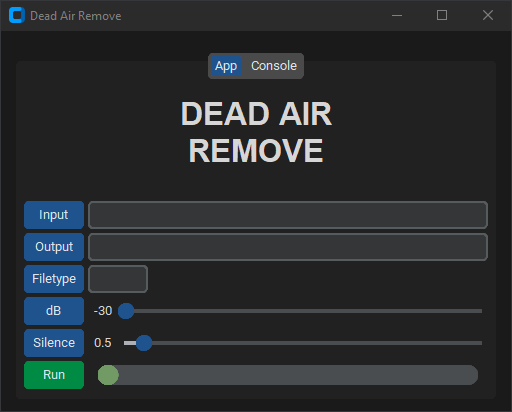

## A Python app for removing dead-air/silence from audio files!

This project is a Python CustomTkinter app that uses FFMPEG to remove dead-air from all audio files of a given type within a given folder. The trimmed files are saved to a chosen folder with a prefix added to the file names. The volume level that is considered dead-air and the minimum silence duration are both adjustable.

Pressing ***Ctrl + t*** fills the entries with default test values and creates the necessary folders. Place some audio files in the input folder and change the ***Filetype*** by clicking the ***Filetype*** button and selecting one of your files from the input folder.

