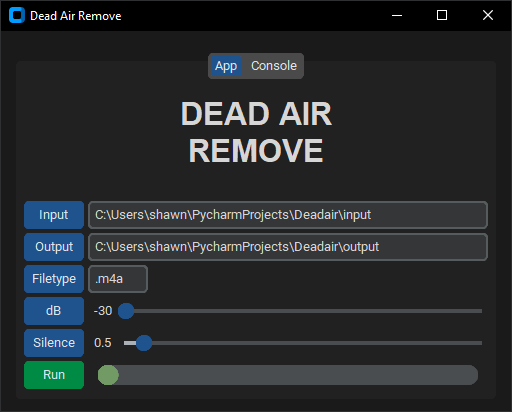
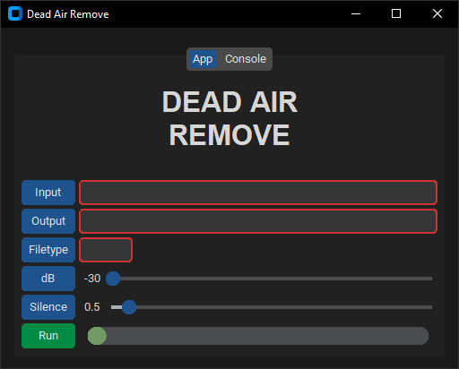
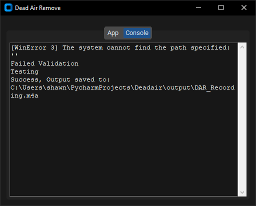

# An app for removing silence from audio files

This project is a Python CustomTkinter app that uses FFMPEG to remove dead-air from all audio files of a given type within a given folder. The trimmed files are saved to a chosen folder with a prefix added to the file names. The volume level that is considered dead-air and the minimum silence duration are both adjustable.

## App Elements

***Input*** and ***Output*** buttons open a folder select dialog and stores the selected folder path in the adjacent entry. The ***Input*** folder is where the files are processed from and the ***Output*** folder is where the processed files will be saved.

***Filetype*** button opens a file select dialog, extracts the filetype from the selected file, and stores the extension in the adjacent entry. All files in the ***Input*** folder with the file extension will be processed. 

***dB*** button sets the adjacent slider to the default value for the volume level that is considered silence. The default decibel value is -30 dB. This means when the volume is below -30 dB the audio will be considered silence.

***Silence*** button sets the adjacent slider to the default value for the minimum duration of silence (in seconds) to be removed. The default is 0.5 seconds. This means that the silence must be at least 0.5 seconds long or longer to be removed.

***Run*** button starts processing the files based on the input values. The adjacent loading bar will fill as the files are processed and a tooltip on the loading bar will display how many files have been processed and how many are left. During processing, the run button will become a cancel button allowing you to cancel processing, finishing the current file.

***Tooltips*** are applied to each button and the loading bar to provide information about each elements function or progress in the case of the loading bar.

## Shortcuts

Pressing ***Ctrl + t*** fills the entries with default test values and creates the necessary folders in the apps folder. Place some audio files in the input folder and change the ***Filetype*** by clicking the ***Filetype*** button and selecting one of your files from the input folder.

## Validation

If there is an error with the inputs the respective input will be outlined in red and an alert will explain the issues. Validation checks for the following. 
- Empty inputs 
- If input/output folders are the same 
- Confirms that input/output folders exist
- Confirms that files exist in the input folder
- If a file of the selected filetype exists in the input folder

## Console Tab

Console output such as print statements and errors have been routed to the console tab. Note that the FFMPEG spacific output is not redirected.

