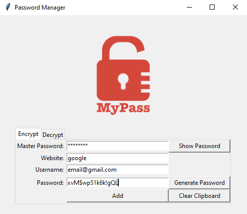
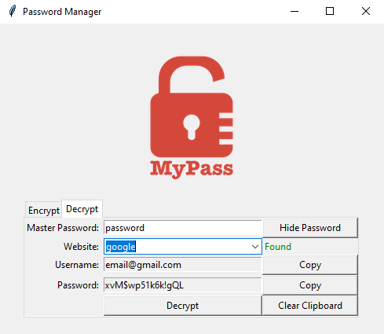

# A secure solution for storing passwords locally

A password manager made with Python and Tkinter that uses Cryptography to securely encrypt passwords with a master password and store them locally.

## Encryption

## Decryption

## Cryptography